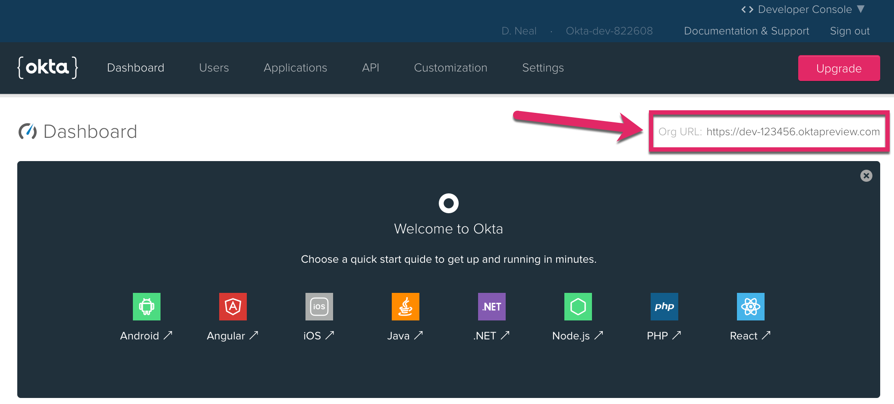

# Build a Secure Node.js App with SQL Server

This is a sample application for the article [Build a Secure Node.js App with SQL Server]().

Built with love, using:

* [Node.js](https://nodejs.org/en/)
* [SQL Server](https://www.microsoft.com/en-us/sql-server/sql-server-2017)
* [hapi](https://hapijs.com/)
* [Vue.js](https://vuejs.org/)

## Requirements

* [Node.js](https://nodejs.org/en/) version 8.0 or higher
* [SQL Server](https://www.microsoft.com/en-us/sql-server/sql-server-2017) version 2012 or higher

If you don't already have access to SQL Server, you can install one locally for development and testing.

### Install SQL Server on Windows

Download and install [SQL Server Developer Edition](https://www.microsoft.com/en-us/sql-server/sql-server-downloads).

### Install SQL Server on Mac or Linux

1. Install [Docker](https://docs.docker.com/docker-for-mac/install/)
1. Run the following in a terminal. Change the values of `name_your_container` and `SA_PASSWORD=P@55w0rd` to what you desire.

```bash
docker pull microsoft/mssql-server-linux:2017-latest
docker run -d --name name_your_container -e 'ACCEPT_EULA=Y' -e 'SA_PASSWORD=P@55w0rd' -e 'MSSQL_PID=Developer' -p 1433:1433 microsoft/mssql-server-linux:2017-latest
```

Note: For more information on running SQL Server for Linux, see [SQL Server Running on a Mac?!](https://medium.com/@reverentgeek/sql-server-running-on-a-mac-3efafda48861)

## Set Up Local Development Environment

1. Clone this repository (or download and extract the zip file)
2. Open a command prompt or terminal
3. Change to the directory that contains the project files
4. Run `npm install` to install all the dependencies
5. Copy `.env.sample` to `.env`, and modify the settings to match your environment

```bash
# Hapi Server Configuration
PORT=8080
HOST=localhost
HOST_URL=http://localhost:8080
COOKIE_ENCRYPT_PWD=superAwesomePasswordStringThatIsAtLeast32CharactersLong!

# SQL Server Connection Configuration
SQL_USER=dbuser
SQL_PASSWORD=P@55w0rd
SQL_DATABASE=calendar
SQL_SERVER=servername
# Change SQL_ENCRYPT=true if using Azure
SQL_ENCRYPT=false

# Okta configuration
OKTA_ORG_URL=https://{yourOktaDomain}
OKTA_CLIENT_ID={yourClientId}
OKTA_CLIENT_SECRET={yourClientSecret}
```

### Initialize Your SQL Database

You will need a SQL database to for this application. If you are running SQL Server locally and don't already have a database, you can create one with the following script. You can use a utility like [Azure Data Studio](https://docs.microsoft.com/en-us/sql/azure-data-studio/download?view=sql-server-2017) to connect to your instance to run this script.

```sql
USE master;
GO

CREATE DATABASE calendar; -- change this to whatever database name you desire
GO
```

Next you can run the following task at the command line or terminal to initialize your database. 

> Note: Make sure you have the correct server, database, user, and password configured in your `.env` file.

```bash
npm run tasks:initdb
```

### Easily Add Authentication to Your Applications with Okta

This application uses Okta for authentication. To complete your development set up, you'll need an Okta developer account. Go to the [Okta Developer Portal](https://developer.okta.com/) and sign up for a forever free Okta account.


After creating your account, click the **Applications** link at the top, and then click **Add Application**.


Next, choose a **Web Application** and click **Next**.


Enter a name for your application, such as **Node-SQL**. Then, click **Done** to finish creating the application.


Near the bottom of the application page you will find a section titled **Client Credentials**. Copy the Client ID and Client secret values and paste them into your `.env` file to replace `{yourClientId}` and `{yourClientSecret}`, respectively.


Click on the **Dashboard** link. On the right side of the page, you should find your Org URL. Copy and paste this value into your `.env` file to replace the value for `OKTA_ORG_URL`.




Next, enable self-service registration. This will allow new users to create their own account. Click on the **Users** menu and select **Registration**.


1. Click on the **Edit** button.
1. Change Self-service registration to Enabled.
1. Click the **Save** button at the bottom of the form.


### Run the Local Web Application

1. Run `npm run dev` to start the development server
1. Browse to `http://localhost:8080`

### Run the Tests

```bash
> npm run test
```

